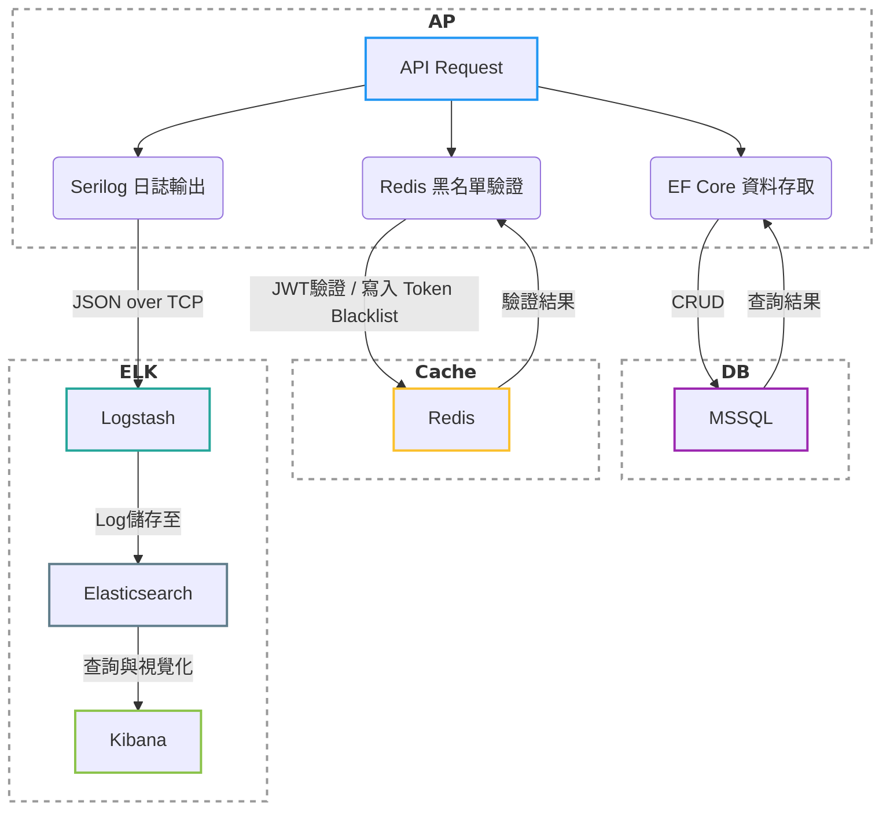

## 系統架構環境
- **ASP.NET Core**：版本 `.NET 9.0.203`
- **C# 語言版本**：v13
- **資料庫**：Microsoft SQL Server（透過 Docker 建立）
- **快取/黑名單儲存**：Redis（透過 Docker 建立）
- **日誌紀錄**：ELK Stack（Elasticsearch + Logstash + Kibana，透過 Docker 建立）

## 系統流程關係圖

## 系統功能總覽

### 🔐 JWT Token 驗證機制
- 採用標準 JWT 格式實作登入與授權流程
- 支援解析與驗證過期時間

### 📚 Swagger / OpenAPI 文件
- 自動產生 API 說明文件
- 整合 JWT Bearer 驗證支援測試
- 可透過瀏覽器存取並測試 API

### 🌐 全域例外處理（GlobalExceptionMiddleware）
- 捕捉所有未處理例外，統一格式回應
- 區分：
  - 預期型錯誤（商業邏輯例外）
  - 非預期錯誤（系統例外、未處理例外）

### ⏱️ RequestTimingMiddleware
- 自動記錄每一筆 API 請求處理時間
- 提供日誌分析依據（整合 Serilog）

### 🧊 Redis 黑名單機制
- 登出後將 JWT 加入 Redis 黑名單
- 每次請求驗證時自動檢查是否為黑名單 Token

### 📊 Serilog 結構化日誌
- 使用 Serilog 記錄結構化日誌
- 支援輸出至 Console 與 ELK (透過 TCP + JSON 格式)

### 📈 ELK 整合
- Logstash 透過 TCP 接收 Serilog 日誌
- Elasticsearch 儲存日誌
- Kibana 顯示可視化介面
- 支援 JSON codec 與結構化格式過濾
